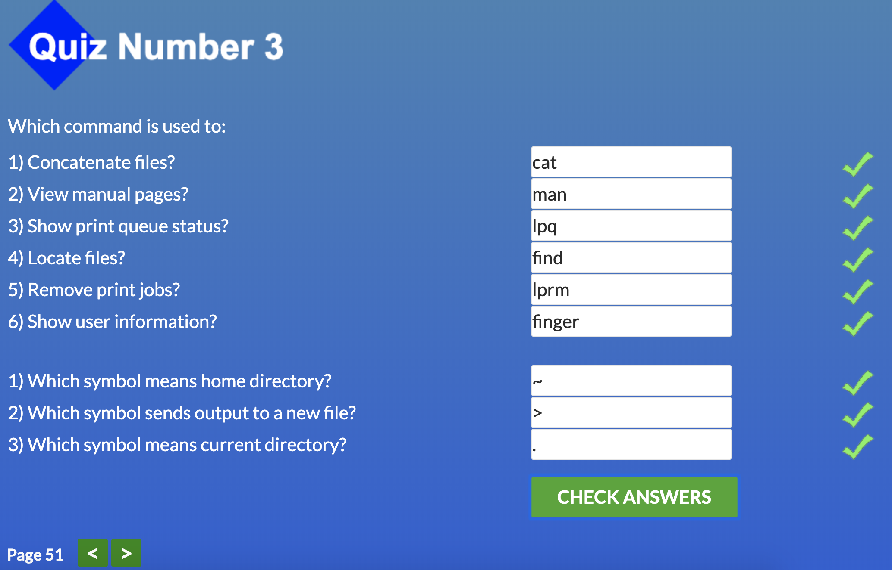

# Stage 0. Self-Study

## Task 1. Git and GitHub

I have experience with Git but the course "How to use Git and GitHub" from Udacity gave me some new information so it was useful for me. Thanks.
Also I want to share the game that can help to learn git commands:

[git-game](https://github.com/git-game/git-game)

## Task 2. Unix Shell

I've been using most of these commands before, but repeating all of them was good for me :) thanks

;
;
;
;
